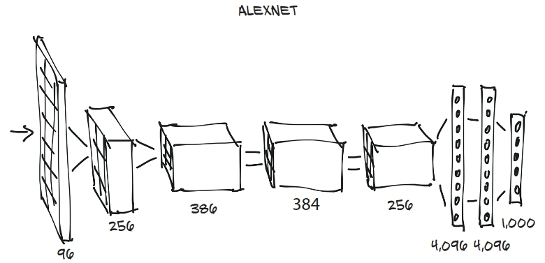
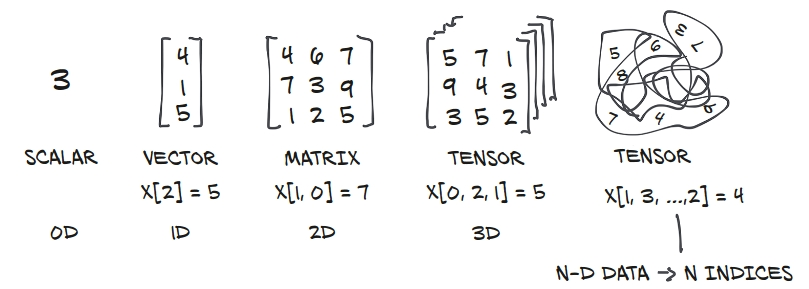
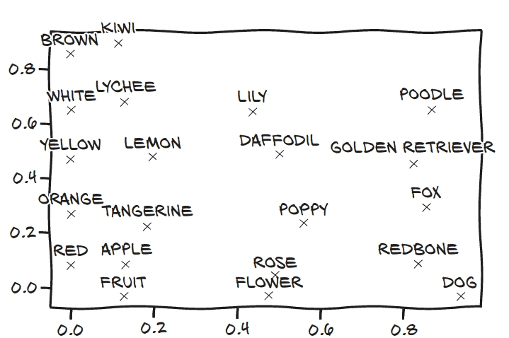
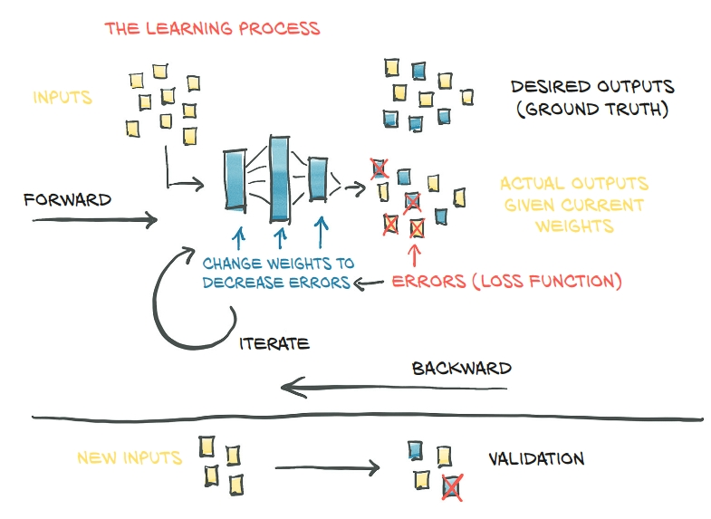
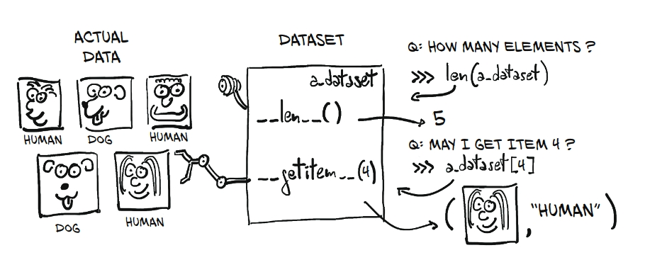
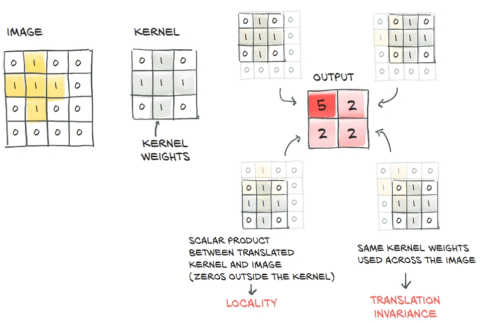
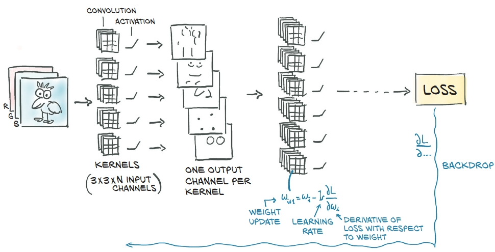
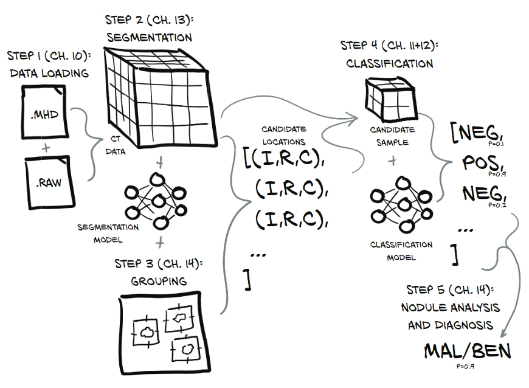

# [Deep Learning With PyThon](https://pytorch.org/assets/deep-learning/Deep-Learning-with-PyTorch.pdf)

### Chapters

* [Chapter 2 - PreTrained Networks](./Chapter2_PretrainedModules)
    * Using Pretrained modules, Testing on ImageNet trained network  
      
* [Chapter 3 - Tensor Basics](./Chapter_3_Tensor_Basics)
    * Tensor Indexing, Storage, Serialization  
    
* [Chapter 4 - Real World Data Representation](./Chapter_4_real_world_data_representation_using_tensors)
    * Representing images, ordinal data, text  
    
* [Chapter 5 - The mechanics of learning](./Chapter_5_the_mechanics_of_learning)
    * [Gradient Descent](./Chapter_5_the_mechanics_of_learning/gradient_descent.ipynb)
    * [Autograd](./Chapter_5_the_mechanics_of_learning/autograd.ipynb)  
      
* [Chager 6 - Fitting Data with NNs](./Chapter_6_using_nn_to_fit_data)  
  
  * [Linear Model](./Chapter_6_using_nn_to_fit_data/fitting_data_with_nn.ipynb)
  * [Basic NN](./Chapter_6_using_nn_to_fit_data/basic_nn.ipynb)
* [Chapter 7 - Is it a bird? Is it a plane?](./Chapter_7_birds_vs_planes/is_it_a_bird.ipynb)  
    
* [Chapter 8 - Using Convolutions to Generalise](./Chapter_8_using_conv_to_generalise)  
      
      
* [End-to-End Cancer Detector](./Chapter_9_cancer_detection)  
    
    * [Data Loading](./Chapter_9_cancer_detection/data_loading.ipynb)
    * [Detecting Suspect Nodules](./Chapter_9_cancer_detection/suspect_detector.ipynb)  
    
    
