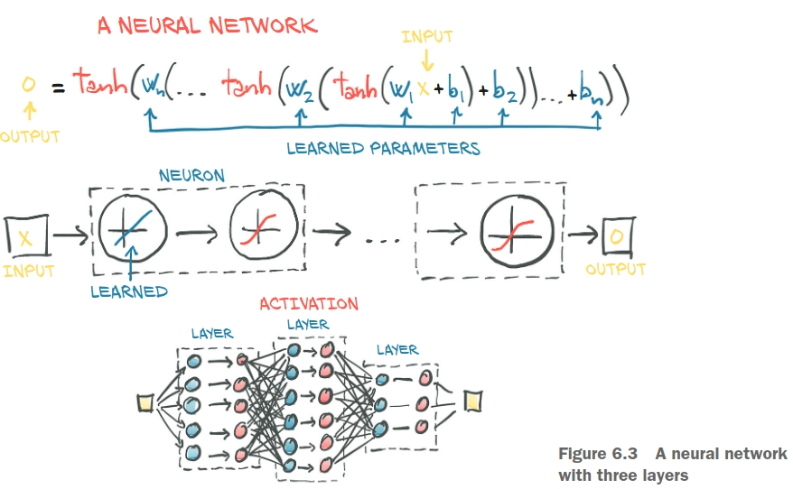

# [Deep Learning With PyThon](https://pytorch.org/assets/deep-learning/Deep-Learning-with-PyTorch.pdf)

### Chapters

* [Chapter 2 - PreTrained Networks](./Chapter2_PretrainedModules)
    * Using Pretrained modules, Testing on ImageNet trained network  
    
* [Chapter 3 - Tensor Basics](./Chapter_3_Tensor_Basics)
    * Tensor Indexing, Storage, Serialization
    
* [Chapter 4 - Real World Data Representation](./Chapter_4_real_world_data_representation_using_tensors)
    * Representing images, ordinal data, text
    
* [Chapter 5 - The mechanics of learning](./Chapter_5_the_mechanics_of_learning)
    * [Gradient Descent](./Chapter_5_the_mechanics_of_learning/gradient_descent.ipynb)
    * [Autograd](./Chapter_5_the_mechanics_of_learning/autograd.ipynb)
    
* [Chager 6 - Fitting Data with NNs](./Chapter_6_using_nn_to_fit_data)
  
  
